## 1. Set up your SAP HANA database in SAP HANA Cloud trial

Please note that it is recommended to use a Trial of the SAP Business Technology Platform (aka SAP BTP), and not a Free Tier or your organization's account, if you do not have it yet: https://developers.sap.com/group.hana-cloud-get-started-1-trial.html

Make sure that you know your database's SQL endpoint and the DBAdmin's password.

## 2. Open your SAP Business Application Studio

If you are using the SAP BTP free trial, then open the SAP Business Application Studio trial from the "Quick Tool Access" section.

Should you have issues opening SAP Business Application Studio (for example when you have had the account for a long time), then check the steps in this tutorial - Set Up SAP Business Application Studio for Development.

## 3. Create a new Dev Space for the developer challenge

Go to your instance of SAP Business Application Studio (further referred to as "BAS").

For this exercise create a new Dev Space called `DevChallengeHANA24` of a kind **Basic** in BAS:

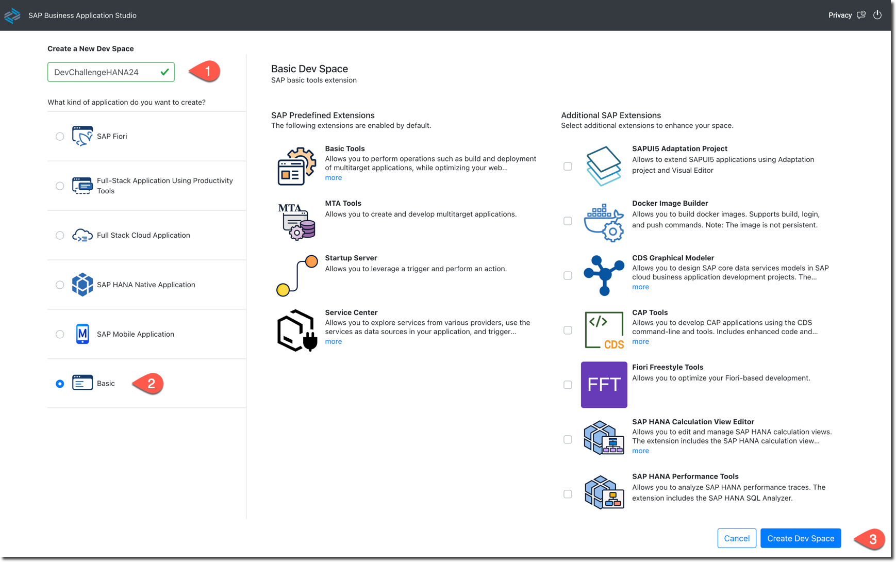

Open the dev space once it is in the state "Running".

Close the Get Started tab if it opens.

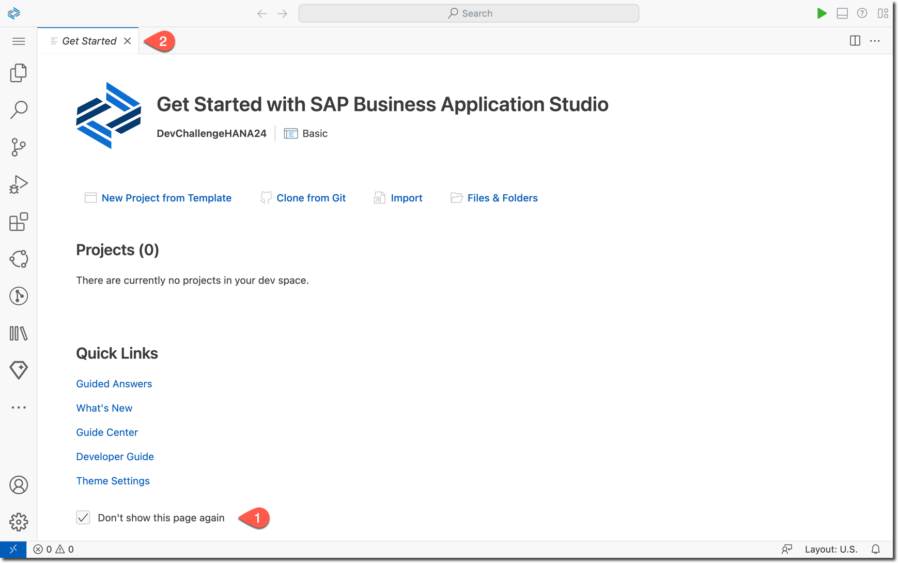

## 4. Import the profile with the required extensions

You want to customize extensions used in SAP BAS. By default it contains many extensions you will not need. At the same time, you need some extensions specific to working with Python and Jupyter notebooks.


Import the profile `HANAwPy` from the gist: https://gist.github.com/Sygyzmundovych/1938132cf5810680c25f675fe3810630


Create the profile only using Extensions and Code snippets...

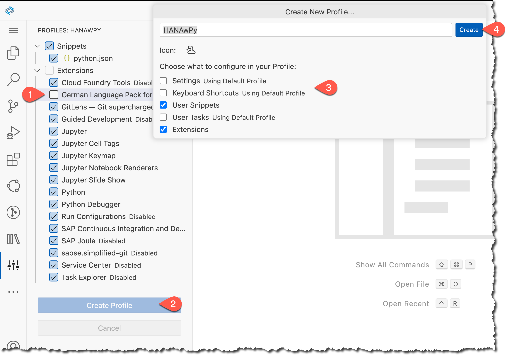

... and switch to this new profile.

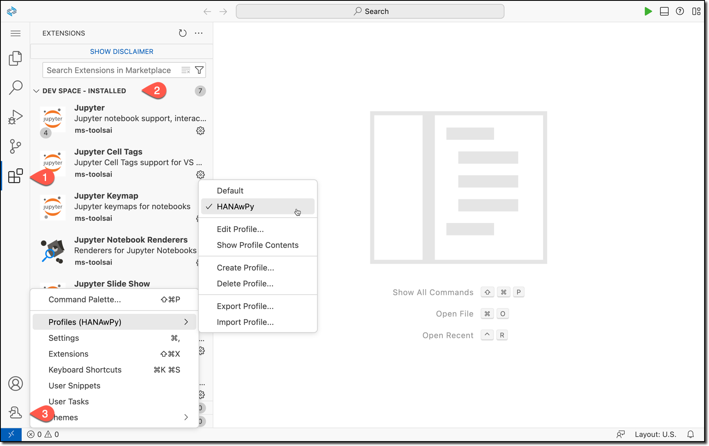

You should see fewer icons in the Activity Bar. When you click on the Extensions icon in the Activity Bar, you should see extensions like **Jupyter** and **Python** in the folder "DEV SPACE - INSTALLED."

As well the icon of the profile should change to the icon with a snake.

## 5. Open the Terminal

Even though we'll use Jupyter Notebooks in the exercises, for this setup exercise, we'll stick solely to the terminal.

Open it from the hamburger menu:

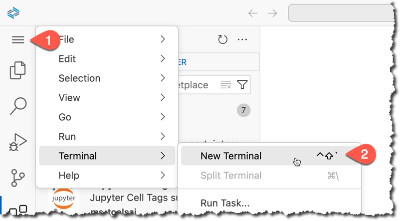

Run a few commands in the terminal to explore the setup:

```sh
whoami
pwd
ls
hostname
echo ${WORKSPACE_ID}
clear
```

You can also maximize the terminal's panel.

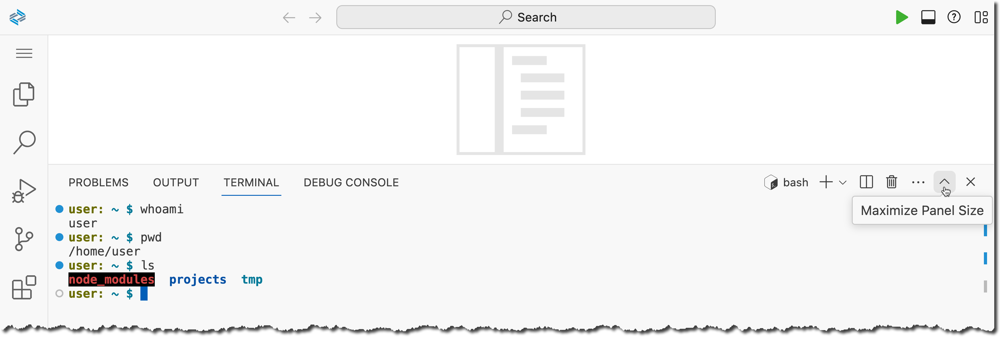

Check the available locale and set the missing values.

```sh
locale -a
export LC_ALL=C.utf8
locale
```

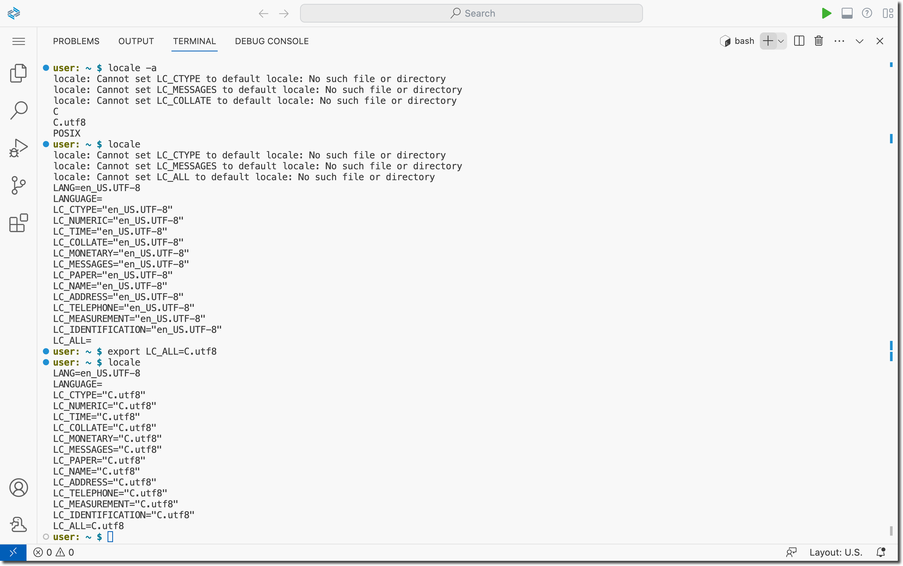

## 6. Install SAP HANA Client in the dev space

SAP Development Tools https://tools.hana.ondemand.com/#hanatools gives you access to the SAP HANA Client, which developers can use to connect client applications to SAP HANA databases.

You need to agree to the SAP developer license https://tools.hana.ondemand.com/developer-license-3_2.txt to use these tools.

Download the SAP HANA Client installer to your BAS Dev Space using the following commands in the terminal.

```sh
wget --no-cookies --header "Cookie: eula_3_2_agreed=tools.hana.ondemand.com/developer-license-3_2.txt" "https://tools.hana.ondemand.com/additional/hanaclient-latest-linux-x64.tar.gz" -O /tmp/hanaclient-latest.tar.gz

tar -xvf /tmp/hanaclient-latest.tar.gz -C /tmp/
```

Check and install the drivers and tools.

```sh
/tmp/client/hdbinst -l

/tmp/client/hdbinst --batch --hostname=${WORKSPACE_ID}
```

Note that the client has been installed in `~/sap/hdbclient` by default because of the `--batch` flag.

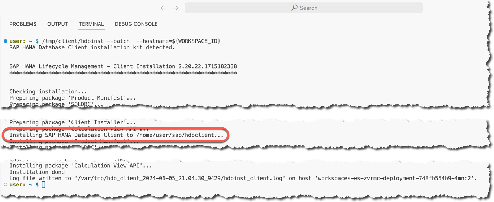

## 7. Use the HANA Client user store to store DBAdmin credentials

Check the SQL endpoint of your SAP HANA database. 

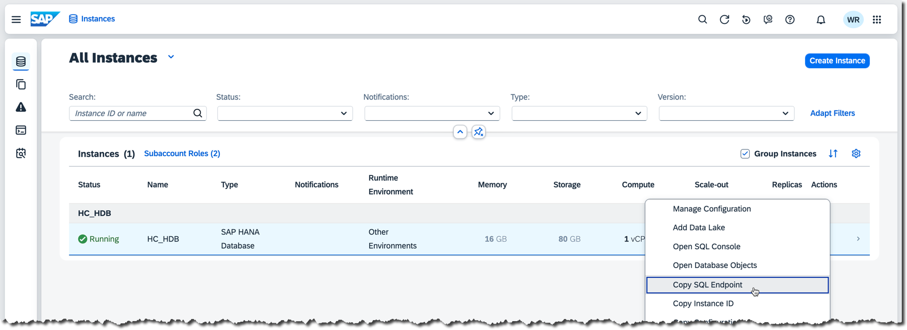

In the example below, it is `81095c17-3e52-424f-8924-b5e09da9a80a.hana.trial-us10.hanacloud.ondemand.com:443`. When creating a key `myDBAdmin` to store the credentials of your database administrator user, make sure to replace it with the value of the SQL endpoint of your own database.

```shell
~/sap/hdbclient/hdbuserstore -i SET myDBAdmin 81095c17-3e52-424f-8924-b5e09da9a80a.hana.trial-us10.hanacloud.ondemand.com:443 DBAdmin
~/sap/hdbclient/hdbuserstore LIST
```

Check that user credentials are correct by connecting to the database to run a simple query.

```sh
~/sap/hdbclient/hdbsql -U myDBAdmin -jA "SELECT Current_User FROM DUMMY"
```

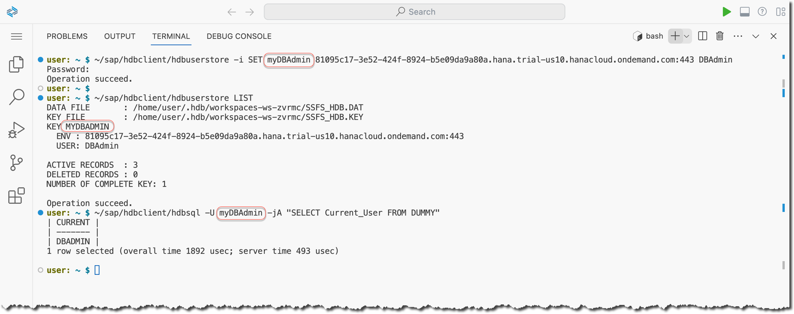

## 8. Create the `DevChallenger` user in your database instance in the SAP HANA Cloud Trial

``sh
~/sap/hdbclient/hdbsql -U myDBAdmin
``

Switch the input to multiline SQL statements separated with `;` by default.

```SQL
\multiline ON
\align ON
\pager OFF
```

Execute SQL statement to create a user `DEVCHALLENGER` (with a password `Up2TheChallenge!Iam` in the example below).

```SQL
CREATE USER DevChallenger 
PASSWORD "Up2TheChallenge!Iam" --replace this with your password of choice!
NO FORCE_FIRST_PASSWORD_CHANGE;
```

Execute the SQL statement to grant a role `AFL__SYS_AFL_AFLPAL_EXECUTE` to the user `DEVCHALLENGER`.

```SQL
GRANT AFL__SYS_AFL_AFLPAL_EXECUTE TO DevChallenger;
```

Optionally, check that the user record has been added to the `USERS` system table.

```SQL
SELECT COUNT(*) FROM USERS WHERE USER_NAME='DEVCHALLENGER';
```

Quit the `hdbsql` utility.

```SQL
\quit
```

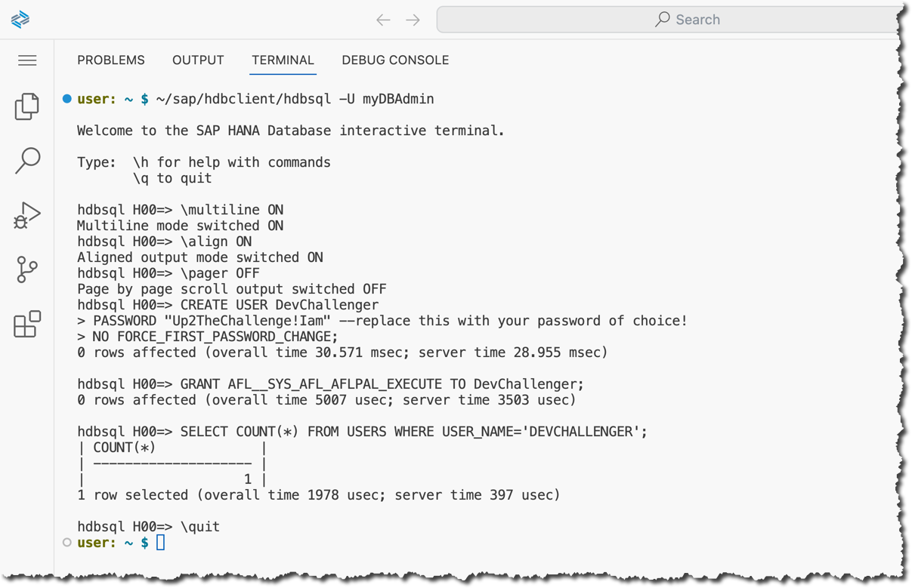

## 10. Create a Python virtual environment `.venv`...

...and activate it.

```shell
python3 -m venv ~/projects/.venv --upgrade-deps
source ~/projects/.venv/bin/activate
python -m pip list
```


Install the Python packages you will use later to work with SAP HANA using Python and SQL from Jupyter Notebooks.

```shell
python -m pip install --upgrade --require-virtualenv ipykernel ipython-sql pandas hdbcli sqlalchemy-hana hana_ml
```

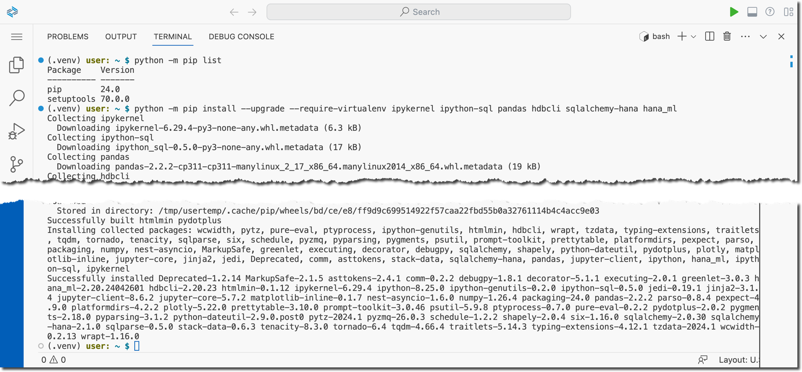

## 11. Use SQL statements in the IPython

IPython is a terminal-based interactive Python REPL that provides the kernel used by Jupyter Notebooks. The `ipython-sql` package is an extension that allows you to run SQL statements from IPython (and Jupyter Notebooks) using a magic `%sql`.  It utilizes SQLAlchemy.

Try it out.

```sh
export HDB_USE_IDENT=${WORKSPACE_ID} 
ipython
```

And then in IPython:

```Python
%load_ext sql
%sql hana://userkey=myDevChallenger
%sql SELECT Current_User FROM DUMMY
%sql hana://userkey=myDBAdmin
%sql
hana_db_info = %sql SELECT "KEY", "VALUE" FROM "M_HOST_INFORMATION" WHERE "KEY" IN ('build_cloud_edition', 'start_time')
type(hana_db_info)
hana_db_info.DataFrame()
print("That's the end of the setup exercise!")
quit
```

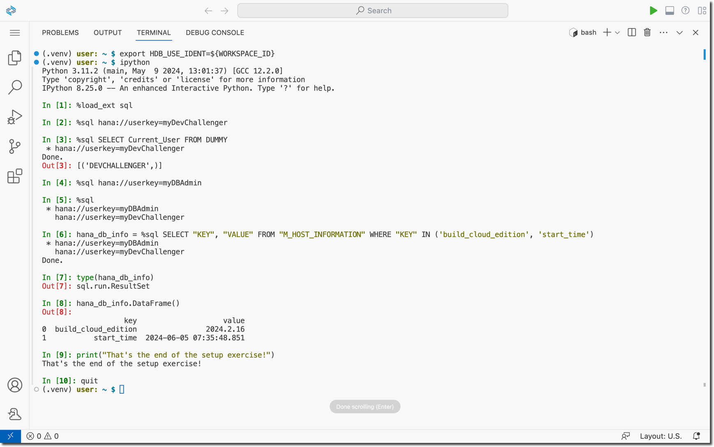

If you did this whole exercise to participate in the Developer Challenge in June 2024, then this screenshot is what is required from you to provide 🤓 