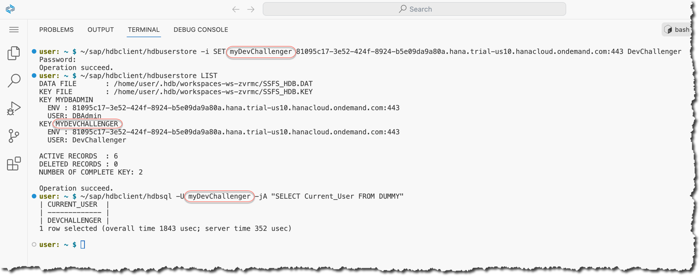

## 1. Set up your SAP HANA database in SAP HANA Cloud trial

If you don't already have it, it's recommended to use a trial of the SAP Business Technology Platform (aka SAP BTP), not a Free Tier or your organization's account: https://developers.sap.com/group.hana-cloud-get-started-1-trial.html

Make sure that you know your database's SQL endpoint and the **DBAdmin**'s password.

## 2. Open your SAP Business Application Studio

If you are using the SAP BTP free trial, open the SAP Business Application Studio trial from the "Quick Tool Access" section.

If you have issues opening SAP Business Application Studio (for example, if you've had the account for a long time), check the steps in this tutorial: [Set Up SAP Business Application Studio for Development](https://developers.sap.com/tutorials/appstudio-onboarding.html).

## 3. Create a new Dev Space for the developer challenge

Go to your instance of SAP Business Application Studio (referred to as "BAS" from here on).

For this exercise, create a new Dev Space called `DevChallengeHANA24` of a kind **Basic** in BAS:


Open the dev space once it is in the "Running" state.

Close the **Get Started** tab if it opens.


## 4. Import the BAS profile with the required extensions

SAP Business Application Studio is based on the [open source version of the Microsoft VS Code](https://github.com/microsoft/vscode?tab=readme-ov-file#visual-studio-code---open-source-code---oss) and introduces many SAP-specific components.

VS Code-compatible extensions available at https://open-vsx.org/ can be installed in SAP BAS.

Customize the extensions used in SAP BAS by modifying [the profile](https://code.visualstudio.com/docs/editor/profiles). By default, it contains many extensions you won't need when working on data projects. However, you need some specific extensions for working with Python and Jupyter notebooks.


Import the profile `HANAwPy` from this gist: https://gist.github.com/Sygyzmundovych/1938132cf5810680c25f675fe3810630


Create the profile only using Extensions and Code snippets...


... and switch to this new profile.


You should see fewer icons in the Activity Bar. When you click on the Extensions icon in the Activity Bar, you should see extensions like **Jupyter** and **Python** in the "DEV SPACE - INSTALLED" folder.

Also, the profile icon should change to one with a snake  from the [codicon icon font](https://github.com/microsoft/vscode-codicons/tree/main?tab=readme-ov-file#codicons).

## 5. Open the Terminal

Even though you'll use Jupyter Notebooks in the later exercises, for this setup exercise, you'll stick solely to the [terminal](https://code.visualstudio.com/docs/terminal/basics).

Open it from the hamburger menu:


Run a few commands in the terminal to explore the environment:

```sh
whoami
pwd
ls
hostname
echo ${WORKSPACE_ID}
clear
```

You can also maximize the terminal's panel.


Check the available locale and set the missing values.

```sh
locale -a
export LC_ALL=C.utf8
locale
```


## 6. Install SAP HANA Client in the dev space

SAP Development Tools https://tools.hana.ondemand.com/#hanatools give you access to the [SAP HANA Client](https://help.sap.com/docs/SAP_HANA_CLIENT), which developers can use to connect client applications to SAP HANA databases. SAP HANA Clients comes with some additional tools like [`hdbsql`](https://help.sap.com/docs/SAP_HANA_CLIENT/f1b440ded6144a54ada97ff95dac7adf/c22c67c3bb571014afebeb4a76c3d95d.html?version=2.20&locale=en-US) as the a command-line tool or [`hdbuserstore`](https://help.sap.com/docs/SAP_HANA_CLIENT/f1b440ded6144a54ada97ff95dac7adf/708e5fe0e44a4764a1b6b5ea549b88f4.html?version=2.20&locale=en-US) to store user credentials securely on a client side.

You need to agree to the SAP developer license https://tools.hana.ondemand.com/developer-license-3_2.txt to use these SAP HANA Client available on SAP Development Tools.

Download the SAP HANA Client installer to your Dev Space in BAS using the following commands in the terminal.

```sh
wget --no-cookies --header "Cookie: eula_3_2_agreed=tools.hana.ondemand.com/developer-license-3_2.txt" "https://tools.hana.ondemand.com/additional/hanaclient-latest-linux-x64.tar.gz" -O /tmp/hanaclient-latest.tar.gz

tar -xvf /tmp/hanaclient-latest.tar.gz -C /tmp/
```

Check and install the drivers and tools.

```sh
/tmp/client/hdbinst -l

/tmp/client/hdbinst --batch --hostname=${WORKSPACE_ID}
```

🤓 Note that the client has been installed in `~/sap/hdbclient` by default because of the `--batch` flag.

🤓 Note as well the use of the `--hostname=${WORKSPACE_ID}` flag. The BAS dev space is getting another `hostname` after each restart, and setting this parameter during the installation ensures SAP HANA Client works properly.


## 7. Use the SAP HANA user store for DBAdmin credentials

Check and note the SQL endpoint of your SAP HANA database.


In the example below, it is `81095c17-3e52-424f-8924-b5e09da9a80a.hana.trial-us10.hanacloud.ondemand.com:443`. When creating a key `myDBAdmin` to store the credentials of your database administrator user, make sure to replace `${sap_hana_db_endpoint}` with the value of the SQL endpoint of your own database.

```shell
~/sap/hdbclient/hdbuserstore -i SET myDBAdmin ${sap_hana_db_endpoint} DBAdmin
~/sap/hdbclient/hdbuserstore LIST
```

Check that user credentials are correct by connecting to the database to run a simple query using the `hdbsql` command-line tool and a user key `myDBAdmin` from the user store. 🤓 You can check the meaning of the `hdbsql` options such as `-j` or `-A` in [the documentation](https://help.sap.com/docs/SAP_HANA_CLIENT/f1b440ded6144a54ada97ff95dac7adf/c24d054bbb571014b253ac5d6943b5bd.html?version=2.20&locale=en-US).

```sh
~/sap/hdbclient/hdbsql -U myDBAdmin -jA "SELECT Current_User FROM DUMMY"
```


## 8. Create the `DevChallenger` user in your database instance in the SAP HANA Cloud Trial

Use SAP HANA CLI `hdbsql` to connect using your `myDBAdmin` user key from the local secure store.

```sh
~/sap/hdbclient/hdbsql -U myDBAdmin
```

Switch the input to multiline SQL statements separated with `;` by default. 

```SQL
\multiline ON
\align ON
\pager OFF
```

🤓 You can show help on internal slash commands using `\help` in the `hdbsql` prompt.

Execute SQL statements to create a user `DEVCHALLENGER` (with a password `Up2TheChallenge!Iam` in the example below).

```SQL
CREATE USER DevChallenger 
PASSWORD "Up2TheChallenge!Iam" --replace this with your password of choice!
NO FORCE_FIRST_PASSWORD_CHANGE;
```

Execute SQL statements to grant a role [`AFL__SYS_AFL_AFLPAL_EXECUTE`](https://help.sap.com/docs/hana-cloud-database/sap-hana-cloud-sap-hana-database-predictive-analysis-library/security-security-253f2b5?version=2024_1_QRC&locale=en-US) to the user `DEVCHALLENGER`.

```SQL
GRANT AFL__SYS_AFL_AFLPAL_EXECUTE TO DevChallenger;
```

Optionally, check that the user record has been added to the `USERS` system table.

```SQL
SELECT COUNT(*) FROM USERS WHERE USER_NAME='DEVCHALLENGER';
```

Quit the `hdbsql` utility.

```SQL
\quit
```


## 9. Use the HANA Client user store to store DevChallenger credentials

Store the credentials of the DevChallenger user in the HANA Client user store similarly to what you did for the user DBAdmin, but now using the key `myDevChallenger`.



## 10. Create a Python virtual environment `.venv`...

...and activate it.

🤓 The [`venv` module](https://docs.python.org/3/library/venv.html#module-venv) supports creating lightweight “virtual environments”. A virtual environment is created on top of an existing Python installation, known as the virtual environment’s “base” Python, and may optionally be isolated from the packages in the base environment, so only those explicitly installed in the virtual environment are available.

```shell
python3 -m venv ~/projects/.venv --upgrade-deps
source ~/projects/.venv/bin/activate
python -m pip list
```


Install the Python packages you will use later to work with SAP HANA using Python and SQL from Jupyter Notebooks.

```shell
python -m pip install --upgrade --require-virtualenv ipykernel ipython-sql pandas hdbcli sqlalchemy-hana hana_ml
```


🤓 The flag `--require-virtualenv` is used to prevent you from mistakenly installing these packages into the Python's base environment.

## 11. Use SQL statements in the IPython

🤓 [IPython](https://ipython.org/) is a terminal-based interactive Python shell that provides the kernel used by Jupyter Notebooks also. The [`ipython-sql`](https://github.com/catherinedevlin/ipython-sql?tab=readme-ov-file#ipython-sql) package is an extension that allows you to run SQL statements from IPython (and Jupyter Notebooks) using a magic `%sql`.  It utilizes [SQLAlchemy](https://github.com/SAP/sqlalchemy-hana/tree/main?tab=readme-ov-file#sqlalchemy-dialect-for-sap-hana).

Try it out.

```sh
export HDB_USE_IDENT=${WORKSPACE_ID} 
ipython
```

🤓 Note the use of the [`HDB_USE_IDENT` environment variable](https://help.sap.com/docs/SAP_HANA_CLIENT/f1b440ded6144a54ada97ff95dac7adf/708e5fe0e44a4764a1b6b5ea549b88f4.html?q=HDB_USE_IDENT) to enable access to the user keys from the proper HANA user store. 

And then in IPython:

```Python
%load_ext sql
%sql hana://userkey=myDevChallenger
%sql SELECT Current_User FROM DUMMY
%sql hana://userkey=myDBAdmin
%sql
hana_db_info = %sql SELECT "KEY", "VALUE" FROM "M_HOST_INFORMATION" WHERE "KEY" IN ('build_cloud_edition', 'start_time')
type(hana_db_info)
hana_db_info.DataFrame()
print("That's the end of the setup exercise!")
quit
```


If you did this whole exercise to participate in the [Developer Challenge in June 2024](https://community.sap.com/t5/application-development-blog-posts/developer-challenge-sap-hana-multi-model-using-python-in-sap-business/ba-p/13722560), then this screenshot is what is required from you to provide in the thread https://community.sap.com/t5/application-development-discussions/submissions-for-quot-sap-hana-cloud-multi-model-quot-developer-challenge/m-p/13722570/highlight/true#M2028356  🎉